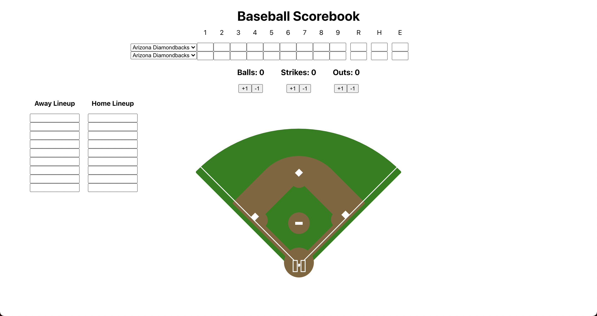

## Baseball Scorebook
- Just like the old school paper baseball scorebooks, this digital version allows you to score your favorite team's games! Also works as the perfect companion to [Dice Baseball!](https://github.com/caseymacleod22/dice-baseball)

## 💻 Technologies Used
- JavaScript
- React
- CSS
- Netlify (deployment)

## ⚙️ Features
- ALlows users to score the game pitch by pitch by tracking balls, strikes and outs.
- Full 9 inning scoreboard to track both teams runs by inning, hits and errors.
- Lineup card for both home and away teams.
- Full baseball diamond made entirely in CSS.
- Interactive bases that change color on click to signify a runner is occupying that base.

## Screenshots
Full Scorebook

## Future Improvements

- Allow user to import lineups from live games.
- Track individual players results at the plate (i.e 1-3 Groundout, Solo HR, Lineout)
- Add more interaction to the field.

## ⚾️✏️ Check It Out!
[Start Scoring Here!](https://baseball-scorebook.netlify.app/)